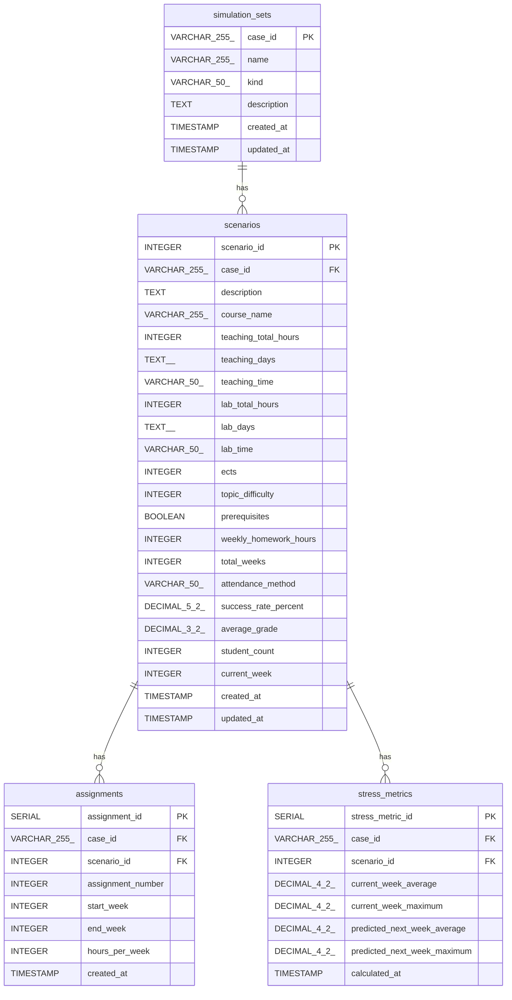

# Database Documentation

This document provides a comprehensive overview of the database setup for the What-If Tool project. It covers the database schema, its integration with Docker, and how it's initialized and seeded.

## Docker Integration

The PostgreSQL database is containerized using Docker and managed via the `docker-compose.yml` file. This approach ensures a consistent and reproducible database environment for development and deployment.

Key aspects of the Docker integration include:

-   **Service Name**: The database service is named `postgres` in the `docker-compose.yml` file.
-   **Image**: It uses the official `postgres:17.5` image.
-   **Environment Variables**: The database is configured using the following environment variables:
    -   `POSTGRES_USER`: `whatifuser`
    -   `POSTGRES_PASSWORD`: `whatifpassword`
    -   `POSTGRES_DB`: `whatifdatabase`
-   **Ports**: The container's port `5432` is mapped to the host's port `5432` for direct database access.
-   **Volumes**:
    -   `./postgres_whatif_data:/var/lib/postgresql/data`: This named volume persists the database data, ensuring that data is not lost when the container is stopped or removed.
    -   `./db/schema.sql:/docker-entrypoint-initdb.d/01-schema.sql`: This mounts the schema file into the container's initialization directory.
    -   `./db/seed.sql:/docker-entrypoint-initdb.d/02-seed.sql`: This mounts the seed file into the container's initialization directory.

## Database Schema

The database is designed to store information about simulation sets, scenarios, assignments, and stress metrics.

### Tables

#### `simulation_sets`

Stores the main information about a simulation set.

| Column        | Type           | Constraints                 | Description                                 |
| :------------ | :------------- | :-------------------------- | :------------------------------------------ |
| `case_id`     | `VARCHAR(255)` | `PRIMARY KEY`               | The unique identifier for a simulation set. |
| `name`        | `VARCHAR(255)` | `NOT NULL`                  | The name of the simulation set.             |
| `kind`        | `VARCHAR(50)`  |                             | The kind of simulation (e.g., 'stress').    |
| `description` | `TEXT`         |                             | A description of the simulation set.        |
| `created_at`  | `TIMESTAMP`    | `DEFAULT CURRENT_TIMESTAMP` | The timestamp of creation.                  |
| `updated_at`  | `TIMESTAMP`    | `DEFAULT CURRENT_TIMESTAMP` | The timestamp of the last update.           |

#### `scenarios`

Stores the details for each scenario, including course information.

| Column        | Type           | Constraints                                     | Description                                  |
| :------------ | :------------- | :---------------------------------------------- | :------------------------------------------- |
| `scenario_id` | `INTEGER`      | `NOT NULL`                                      | The identifier for a scenario within a case. |
| `case_id`     | `VARCHAR(255)` | `NOT NULL, REFERENCES simulation_sets(case_id)` | The foreign key to `simulation_sets`.        |
| `description` | `TEXT`         |                                                 | A description of the scenario.               |
| `course_name` | `VARCHAR(255)` | `NOT NULL`                                      | The name of the course.                      |
| ...           | ...            | ...                                             | (Other course-related fields)                |
| `created_at`  | `TIMESTAMP`    | `DEFAULT CURRENT_TIMESTAMP`                     | The timestamp of creation.                   |
| `updated_at`  | `TIMESTAMP`    | `DEFAULT CURRENT_TIMESTAMP`                     | The timestamp of the last update.            |

#### `assignments`

Stores assignment details for each scenario.

| Column              | Type           | Constraints                 | Description                                      |
| :------------------ | :------------- | :-------------------------- | :----------------------------------------------- |
| `assignment_id`     | `SERIAL`       | `PRIMARY KEY`               | The unique identifier for an assignment.         |
| `case_id`           | `VARCHAR(255)` | `NOT NULL`                  | The foreign key to `scenarios`.                  |
| `scenario_id`       | `INTEGER`      | `NOT NULL`                  | The foreign key to `scenarios`.                  |
| `assignment_number` | `INTEGER`      | `NOT NULL`                  | The number of the assignment.                    |
| `start_week`        | `INTEGER`      | `NOT NULL`                  | The starting week of the assignment.             |
| `end_week`          | `INTEGER`      | `NOT NULL`                  | The ending week of the assignment.               |
| `hours_per_week`    | `INTEGER`      |                             | The estimated hours per week for the assignment. |
| `created_at`        | `TIMESTAMP`    | `DEFAULT CURRENT_TIMESTAMP` | The timestamp of creation.                       |

#### `stress_metrics`

Stores the output stress metrics for each scenario.

| Column                        | Type            | Constraints                 | Description                                     |
| :---------------------------- | :-------------- | :-------------------------- | :---------------------------------------------- |
| `stress_metric_id`            | `SERIAL`        | `PRIMARY KEY`               | The unique identifier for a stress metric.      |
| `case_id`                     | `VARCHAR(255)`  | `NOT NULL`                  | The foreign key to `scenarios`.                 |
| `scenario_id`                 | `INTEGER`       | `NOT NULL`                  | The foreign key to `scenarios`.                 |
| `current_week_average`        | `DECIMAL(4, 2)` |                             | The average stress for the current week.        |
| `current_week_maximum`        | `DECIMAL(4, 2)` |                             | The maximum stress for the current week.        |
| `predicted_next_week_average` | `DECIMAL(4, 2)` |                             | The predicted average stress for the next week. |
| `predicted_next_week_maximum` | `DECIMAL(4, 2)` |                             | The predicted maximum stress for the next week. |
| `calculated_at`               | `TIMESTAMP`     | `DEFAULT CURRENT_TIMESTAMP` | The timestamp of calculation.                   |

### Database Diagram

## Initialization and Seeding

When the `postgres` container is started for the first time, it automatically executes the SQL files found in the `/docker-entrypoint-initdb.d` directory.

1.  **`01-schema.sql`**: This script is executed first. It creates the database schema, including all tables, indexes, and triggers.
2.  **`02-seed.sql`**: After the schema is created, this script is executed. It populates the tables with initial data, which is useful for development and testing. It first truncates all tables to ensure a clean state and then inserts sample data for simulation sets, scenarios, assignments, and stress metrics.
