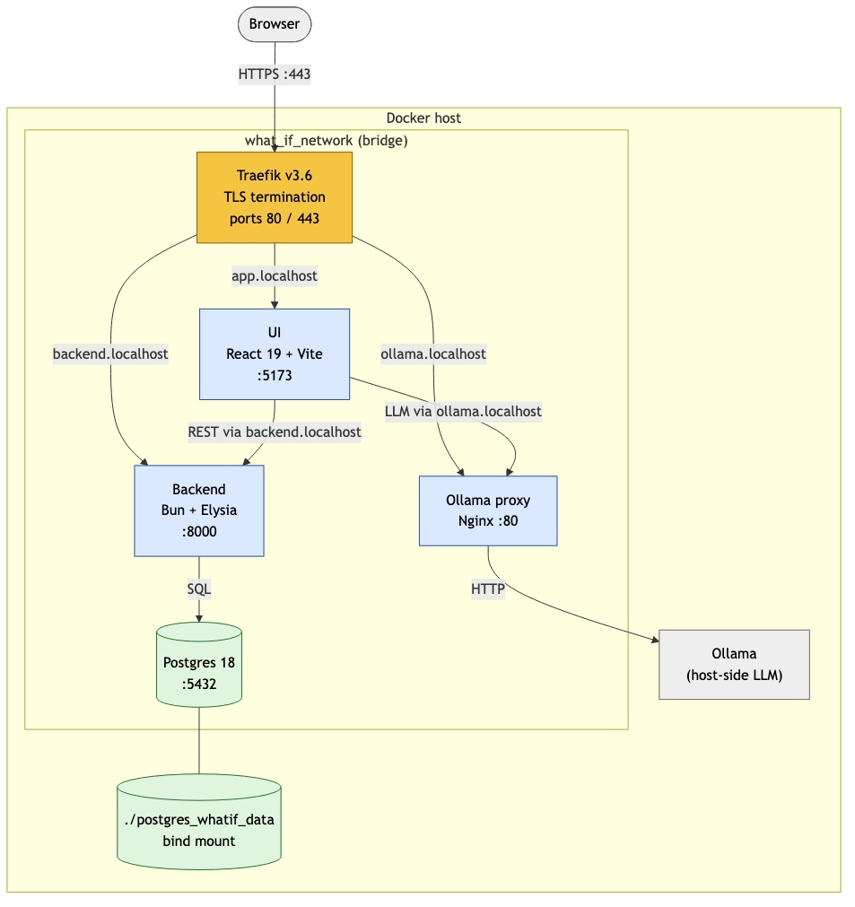
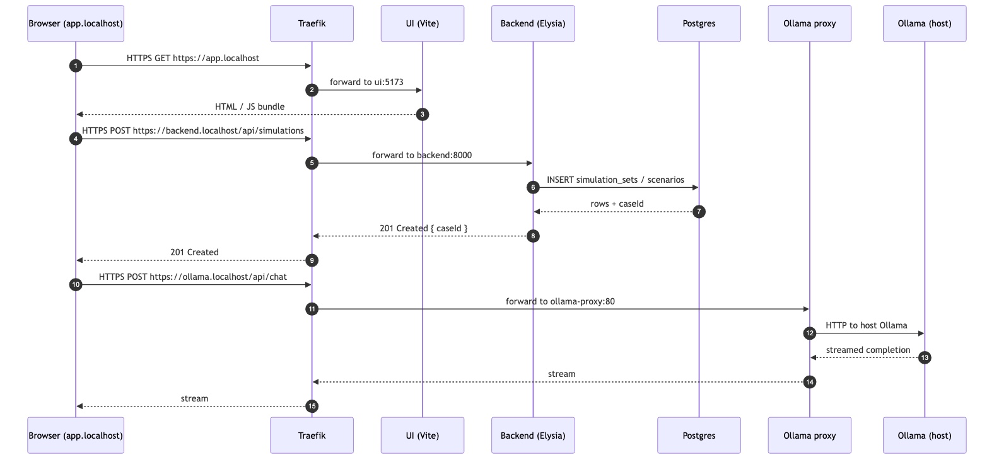
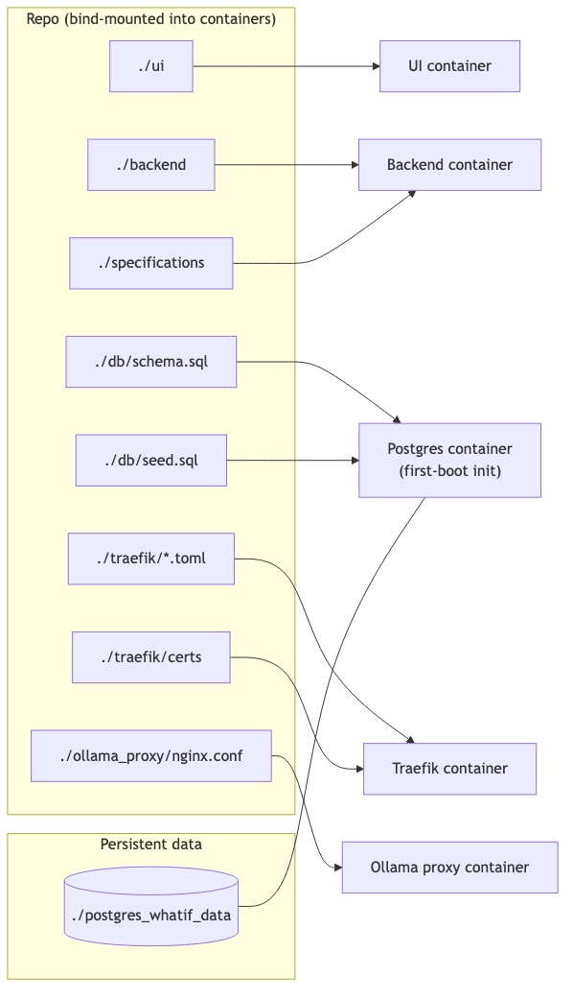

# Deployment Architecture

This document describes how the **AI4Work What-If Tool** is deployed and how
its components interact at runtime. The system is delivered as a set of
Docker containers orchestrated by Docker Compose, all attached to a single
bridge network (`what_if_network`). A **Traefik** reverse proxy terminates
TLS on ports 80/443 and routes traffic to internal services by hostname, so
the browser only ever talks to `*.localhost` over HTTPS while the services
themselves remain on the internal Docker network.

---

## Components

| Service           | Image / Stack                | Internal port | Public hostname           | Role                                                                 |
| ----------------- | ---------------------------- | ------------- | ------------------------- | -------------------------------------------------------------------- |
| **Traefik**       | `traefik:v3.6.15`            | 80 / 443      | `traefik.localhost`       | Edge router, TLS termination, host-based routing                     |
| **UI**            | React 19 + Vite (Bun)        | 5173          | `app.localhost`           | Scenario builder, comparison views, AI chat                          |
| **Backend**       | Bun + Elysia + TypeScript    | 8000          | `backend.localhost`       | REST API, stress calculator, optimization engine                     |
| **Postgres**      | `postgres:18.1`              | 5432          | `postgres.localhost`      | Persistent store; host port remapped to **5433** to avoid conflicts  |
| **Ollama proxy** | Nginx                        | 80            | `ollama.localhost`        | Forwards LLM requests from the browser to a host-side Ollama         |

All inter-service traffic uses Docker DNS names on `what_if_network`
(e.g. the backend reaches the database as `postgres:5432`). Only Traefik's
80/443 and the host-mapped Postgres port 5433 are reachable from outside
the network.

---

## Container topology



> Source: [`diagrams/container-topology.mmd`](diagrams/container-topology.mmd) — edit and re-render with `mmdc` to update the image.

---

## Request flow — typical "create simulation" interaction



> Source: [`diagrams/request-flow.mmd`](diagrams/request-flow.mmd)

Key points:

- **Single entry point.** Everything the browser touches goes through
  Traefik on 443; service-internal ports are never exposed directly.
- **Backend never calls Ollama.** LLM traffic flows browser → Traefik →
  Ollama proxy → host Ollama. The backend is not in that path.
- **Postgres is reachable from the host on 5433** for tooling (psql,
  Postico), but containers always talk to it as `postgres:5432`.

---

## Persistence and configuration



> Source: [`diagrams/persistence.mmd`](diagrams/persistence.mmd)

- **Source folders** (`./ui`, `./backend`) are bind-mounted into the dev
  containers for hot reload. `node_modules` is kept inside the container.
- **Schema and seed** are auto-applied on the first Postgres boot via
  `docker-entrypoint-initdb.d`. On an existing database, schema changes go
  through idempotent SQL migrations in `db/<name>_migration.sql` — see the
  *Database schema workflow* section in `CLAUDE.md`.
- **Postgres data** lives in `./postgres_whatif_data/`. Removing this
  directory and restarting the stack re-runs the init scripts on a fresh
  database.
- **Traefik certs and config** come from `./traefik/`. The dynamic config
  and TOML file are mounted read-only.

---

## Network and security boundaries

- **Internal network.** All services join `what_if_network` (bridge). Only
  Traefik (80/443) and Postgres (host 5433 → container 5432) publish host
  ports.
- **TLS everywhere.** Traefik serves HTTPS on `*.localhost` using certs in
  `./traefik/certs`. Browser ↔ Traefik is encrypted; the hop from Traefik
  to internal services is plain HTTP on the Docker network.
- **Shared secrets.** `JWT_SECRET` is provided via the backend's
  environment in `docker-compose.yml`. Database credentials
  (`whatifuser` / `whatifpassword`) are set on the Postgres container and
  consumed by the backend through `DATABASE_URL`.
- **Ollama.** The proxy is the only path from the browser to the LLM
  runtime, which lets us swap Ollama out (different host, remote endpoint,
  hosted model) by editing only `ollama_proxy/nginx.conf`.

---

## Running the stack

```bash
# Build images (see build_docker_images.sh for the exact tags)
docker-compose build

# Start everything in the background
docker-compose up -d

# Follow logs
docker-compose logs -f backend

# Tear everything down (keeps Postgres data)
docker-compose down

# Reset to a clean database (destroys data, re-runs schema.sql + seed.sql)
docker-compose down
rm -rf postgres_whatif_data/
docker-compose up -d
```

Browser entry points after `docker-compose up`:

- UI: <https://app.localhost>
- Backend API: <https://backend.localhost>
- Ollama proxy: <https://ollama.localhost>
- Traefik dashboard: <https://traefik.localhost>
- Postgres (host tools): `psql -h localhost -p 5433 -U whatifuser -d whatifdatabase`

---

## Regenerating the diagrams

The three diagrams above are committed as JPGs in [`diagrams/`](diagrams/),
with the Mermaid source kept alongside as `*.mmd`. To regenerate after
editing a source file:

```bash
cd docs/diagrams

# Render Mermaid -> PNG (downloads mermaid-cli on first run)
npx -y -p @mermaid-js/mermaid-cli mmdc \
    -i <name>.mmd -o <name>.png -b white -w 1600

# Convert PNG -> JPG (macOS built-in)
sips -s format jpeg -s formatOptions 90 <name>.png --out <name>.jpg
rm <name>.png
```

---

## Related documents

- [`CLAUDE.md`](../CLAUDE.md) — full project overview, coding guidelines,
  and database schema workflow.
- [`docker-compose.yml`](../docker-compose.yml) — canonical source for
  service definitions, ports, and environment variables.
- [`traefik/`](../traefik/) — Traefik static and dynamic configuration.
- [`db/schema.sql`](../db/schema.sql) — canonical database schema applied
  on first boot.
