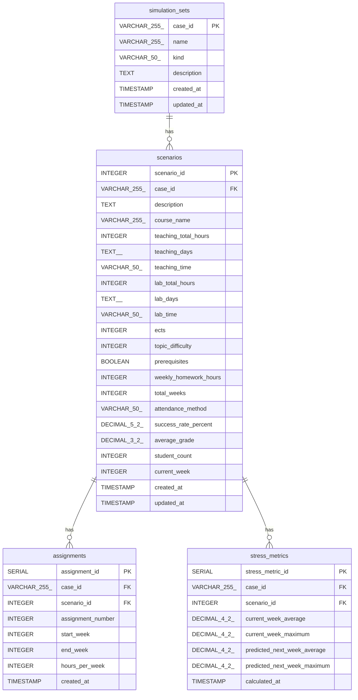

# What-If Tool

This repository contains the source code for the What-If Tool, a web application designed for simulating and analyzing different scenarios, such as course scheduling and stress prediction. The application is built with a microservices architecture and is fully containerized with Docker for easy setup and deployment.

## Table of Contents

-   [Architecture](#architecture)
-   [Getting Started](#getting-started)
    -   [Prerequisites](#prerequisites)
    -   [Installation](#installation)
    -   [Running the Application](#running-the-application)
-   [Services](#services)
    -   [UI (Frontend)](#ui-frontend)
    -   [Backend](#backend)
    -   [Database (PostgreSQL)](#database-postgresql)
    -   [Traefik (Reverse Proxy)](#traefik-reverse-proxy)
    -   [Ollama Proxy](#ollama-proxy)
-   [Local Development with Ollama](#local-development-with-ollama)
-   [Database Schema](#database-schema)

## Architecture

The What-If Tool is composed of several services that work together:

-   **UI (Frontend)**: A React application that provides the user interface for interacting with the tool.
-   **Backend**: An Elysia.js application that handles the business logic, data processing, and API for the UI.
-   **Database**: A PostgreSQL database that stores all the simulation data.
-   **Traefik**: A reverse proxy that manages routing and provides SSL for all services.
-   **Ollama Proxy**: An Nginx proxy to connect to a local Ollama instance for AI-powered features.

All services are orchestrated by Docker Compose, making the development environment consistent and easy to manage.

## Getting Started

### Prerequisites

-   [Docker](https://www.docker.com/get-started)
-   [Docker Compose](https://docs.docker.com/compose/install/)
-   [mkcert](https://github.com/FiloSottile/mkcert) for generating trusted local certificates.
-   [Bun](https://bun.sh/) (for local development outside of Docker)

### Installation

1.  **Clone the repository:**

    ```sh
    git clone <repository-url>
    cd <repository-directory>
    ```

2.  **Install `mkcert` and create a local Certificate Authority (CA):**

    Follow the instructions in the [mkcert documentation](https://github.com/FiloSottile/mkcert) to install it on your system.

    Then, create and install a local CA:

    ```sh
    mkcert -install
    ```

3.  **Generate a wildcard certificate for `*.localhost`:**

    ```sh
    mkcert "*.localhost" traefik.localhost ollama.localhost app.localhost backend.localhost postgres.localhost
    ```

4.  **Move the generated certificate and key to the Traefik directory:**

    ```sh
    mkdir -p traefik/certs
    mv _wildcard.localhost+5.pem traefik/certs/cert.pem
    mv _wildcard.localhost+5-key.pem traefik/certs/key.pem
    ```

    _Note: The exact filenames for the certificate and key may vary. Adjust the command accordingly._

5.  **Set read access for the certificate and key files:**
    ```sh
    chmod 600 traefik/certs/*
    ```

### Running the Application

Once the prerequisites are met and the certificates are in place, you can start the application using Docker Compose:

```sh
docker-compose up -d
```

This command will build the Docker images (if they don't exist) and start all the services in the background.

You can access the different parts of the application at the following URLs:

-   **UI**: `https://app.localhost`
-   **Backend**: `https://backend.localhost`
-   **Traefik Dashboard**: `https://traefik.localhost`

## Services

### UI (Frontend)

-   **Technology**: React, Vite, Bun
-   **URL**: `https://app.localhost`
-   **Source Code**: `/ui`

The UI is the main interface for users. It allows them to create, view, and compare simulation scenarios. It communicates with the backend service to fetch and store data. The local `ui` directory is mounted into the container, which enables live-reloading during development.

### Backend

-   **Technology**: Elysia.js, Drizzle ORM, Bun
-   **URL**: `https://backend.localhost`
-   **Source Code**: `/backend`

The backend service provides a RESTful API for the UI. It's responsible for all business logic, including creating and retrieving simulation sets, and interacting with the PostgreSQL database. It also exposes a Swagger UI for API documentation at `/swagger`.

### Database (PostgreSQL)

-   **Technology**: PostgreSQL
-   **Service Name**: `postgres`
-   **Source Code**: `/db`

The PostgreSQL database stores all the data for the application. The data is persisted in a Docker volume (`postgres_whatif_data`). On the first run, the database is initialized with a schema (`schema.sql`) and populated with seed data (`seed.sql`).

### Traefik (Reverse Proxy)

-   **Technology**: Traefik
-   **Dashboard URL**: `https://traefik.localhost`
-   **Configuration**: `/traefik`

Traefik serves as the reverse proxy for the application. It routes incoming requests to the appropriate service based on the hostname and automatically handles SSL encryption using the `mkcert`-generated certificates.

### Ollama Proxy

-   **Technology**: Nginx
-   **Service Name**: `ollama-proxy`
-   **Configuration**: `/ollama_proxy`

This service is an Nginx proxy that allows the Dockerized services to communicate with an Ollama instance running on the host machine. This is necessary for integrating AI features into the application.

## Local Development with Ollama

If you want to use the AI features of the application, you need to run an Ollama instance locally on your host machine.

To allow the Dockerized application to communicate with your local Ollama server, you need to start it with specific environment variables. On macOS, you can run:

```sh
OLLAMA_HOST=0.0.0.0 OLLAMA_ORIGINS='https://app.localhost,https://backend.localhost' ollama serve
```

This command makes Ollama accessible from the Docker containers.

## Database Schema

The database schema is designed to store simulation data, including scenarios, assignments, and stress metrics.


